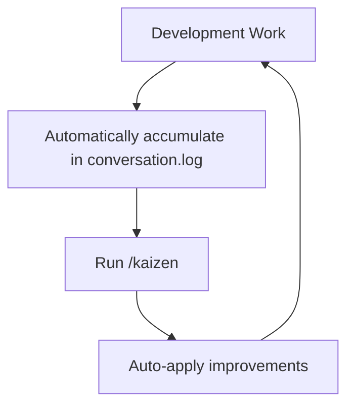

# Jumpstarter - Claude Code Continuous Improvement Template

**A template repository for continuously improving development efficiency based on conversation history with Claude Code**

---

## Have You Experienced This?

```
You: "Implement a new feature"
Claude: [implements]
You: "Too verbose"
Claude: [fixes only the pointed out section]
You: "Are there any other occurrences?"
Claude: [fixes and immediately executes]
You: "Don't execute immediately. Review first"
...
```

**Are you repeating the same feedback over and over?**

Jumpstarter solves this problem with a single `/kaizen` command.

---

## Core Concept

**Improve configuration from AI conversation history**

1. Automatically record conversation history in **conversation.log**
2. Analyze logs with **`/kaizen`** to extract repetitive patterns
3. Auto-generate **Guidelines / Skills / Hooks** to optimize Claude Code



---

## Quick Start

### 1. Use This Template

```bash
# Click "Use this template" on GitHub, or
git clone https://github.com/your-org/jumpstarter.git my-project
cd my-project
```

### 2. Develop with Claude Code

```bash
claude .
# Develop as usual. Conversation history is automatically recorded in conversation.log
```

### 3. Improve Regularly

```bash
# Within Claude Code session
/kaizen
```

Analyzes conversation.log and automatically generates improvement proposals.

---

## Proof of Results

This template was created and validated in the [Go Benchmark Implementation Project](../../tree/feature/kaizen/).

### Before (Pre-improvement)

```
📊 conversation.log Analysis Results
- Repeated feedback patterns: 217
  "Too verbose", "Are there any other...", "Don't execute", etc.
```

### Running `/kaizen`

```
🤖 Auto-generated Improvements
- Guidelines: 5 types (process, communication, quality, documentation, git)
- Sub-Agents: 4 types (comprehensive search, planning, code consistency, doc quality)
- Settings: Enhanced safety (Plan Mode, dangerous operation restrictions)
- Skills: 2 types (code consistency check, doc quality check)
```

### After (Post-improvement)

```
✅ Effects
- Dramatically reduced feedback loops (2-3 rounds → 1 round)
- Faster development with parallel execution (30-50% time savings)
- Reduced fix omissions (automated comprehensive search)
- Technical restrictions on dangerous operations (force push, rm -rf rejection)
- Automatic suppression of verbose documentation
```

---

## Main Features

### 📊 Automatic Conversation Logging

Records all conversations to `.claude/logs/conversation.log` via hooks configured in `.claude/settings.json`.

### 🔍 `/kaizen` Command

Analyzes conversation.log and auto-generates improvements from repetitive patterns:

- **Guidelines**: Behavioral rules for Claude Code (`.claude/guidelines/`)
- **Sub-Agents**: Parallel execution of specialized tasks (`.claude/agents/`)
- **Skills**: Auto-executed quality check functions (`.claude/skills/`)
- **Settings**: Safety restrictions and defaults (`.claude/settings.json`)
- **Hooks**: Event-driven automated processing (`.claude/settings.json`)

### 📝 Ready-to-Use Template

```
.claude/
├── commands/kaizen.md          # Continuous improvement command
├── agents/                     # Sub-agents (parallel specialized tasks)
├── guidelines/                 # Behavioral rules
├── skills/                     # Auto-execution features
├── logs/conversation.log       # Conversation history (auto-generated)
└── settings.json               # Main settings (Plan Mode, safety restrictions)
```

---

## Prompts to Achieve Equivalent Configuration

The following prompts can achieve equivalent configuration to this template:

```
I want to log conversation history with Claude Code. What are the available approaches?
# → Hooks seem to be a good option.
```

```
I want to create a slash command called `/kaizen` that achieves the following:

1. Read the conversation history log between the user and Claude Code, and summarize user feedback to Claude Code
2. Modify Claude Code settings based on the feedback to improve software development with Claude Code
```
