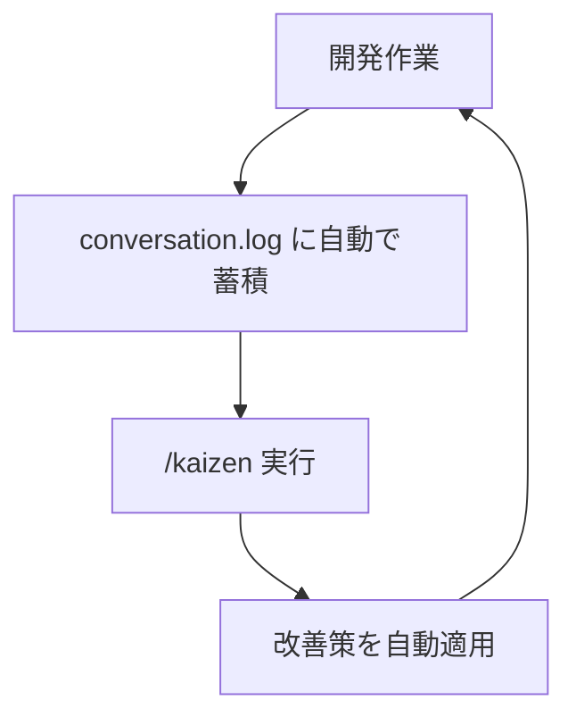

# Jumpstarter - Claude Code 継続的改善テンプレート

**Claude Codeとの対話履歴をもとに、開発効率を継続的に改善していくためのテンプレートリポジトリ**

---

## こんな経験ありませんか？

```
あなた: 「新機能を実装して」
Claude: [実装]
あなた: 「冗長すぎます」
Claude: [指摘箇所の修正]
あなた: 「他に漏れはないですか？」
Claude: [修正してすぐに実行]
あなた: 「すぐに実行しようとしないでください。まずはレビューをしてください」
...
```

**同じフィードバックを何度も繰り返していませんか？**

Jumpstarterは、この問題を `/kaizen` コマンド一つで解決します。

---

## コアコンセプト

**AIとの対話履歴から、設定を改善**

1. **conversation.log** に対話履歴を自動記録
2. **`/kaizen`** でログを分析し、繰り返しパターンを抽出
3. **Guidelines / Skills / Hooks** を自動生成してClaude Codeを最適化



---

## クイックスタート

### 1. このテンプレートを使う

```bash
# GitHub上で "Use this template" をクリック、または
git clone https://github.com/your-org/jumpstarter.git my-project
cd my-project
```

### 2. Claude Codeで開発

```bash
claude .
# 普段通り開発。conversation.logに対話履歴が自動記録されます
```

### 3. 定期的に改善

```bash
# Claude Codeセッション内で
/kaizen
```

conversation.logを分析し、改善提案を自動生成します。

---

## 実証結果

このテンプレートは、 [Goベンチマーク実装プロジェクト](../../tree/feature/kaizen/) で作成・検証しました。

### Before（改善前）

```
📊 conversation.log分析結果
- 繰り返されたフィードバック: 217パターン
  「冗長すぎます」「他に漏れは...」「実行しないで」など
```

### `/kaizen`実行

```
🤖 自動生成された改善策
- Guidelines: 5種類（process, communication, quality, documentation, git）
- Sub-Agents: 4種類（包括的検索、計画作成、コード整合性、ドキュメント品質）
- Settings: 安全性向上（Plan Mode、危険操作制限）
- Skills: 2種類（コード整合性チェック、ドキュメント品質チェック）
```

### After（改善後）

```
✅ 効果
- フィードバックループが激減（2-3往復 → 1往復）
- 並列実行による開発速度向上（30-50%の時間短縮）
- 修正漏れの削減（包括的検索の自動化）
- 危険操作の技術的制限（force push、rm -rf拒否）
- 冗長なドキュメントの自動抑制
```

---

## メインの機能

### 📊 対話ログ自動記録

`.claude/settings.json` に設定されたhooksにより、全ての対話を `.claude/logs/conversation.log` に記録。

### 🔍 `/kaizen` コマンド

conversation.logを分析し、繰り返しパターンから改善策を自動生成：

- **Guidelines**: Claude Codeの振る舞いルール（`.claude/guidelines/`）
- **Sub-Agents**: 専門タスクの並列実行（`.claude/agents/`）
- **Skills**: 自動実行される品質チェック機能（`.claude/skills/`）
- **Settings**: 安全性制限とデフォルト設定（`.claude/settings.json`）
- **Hooks**: イベント駆動の自動処理（`.claude/settings.json`）

### 📝 すぐに使えるテンプレート

```
.claude/
├── commands/kaizen.md          # 継続的改善コマンド
├── agents/                     # サブエージェント（専門タスク並列実行）
├── guidelines/                 # 振る舞いルール
├── skills/                     # 自動実行機能
├── logs/conversation.log       # 対話履歴（自動生成）
└── settings.json               # メイン設定（Plan Mode、安全制限）
```

---

## 本テンプレートと同等のことを実現するプロンプト

下記のようなプロンプトにより、本テンプレートと同等の設定が実現できそうです:

```
ユーザーとClaude Codeの対話履歴をログに残したいです。どのようなやり方がありますか？
# → Hooksが良さそうです。
```

```
`/kaizen` というスラッシュコマンドを作成して、下記のようなことを実現できたらと考えています:

1. ユーザーとClaude Codeの対話履歴のログを読み込み、ユーザーからClaude Codeに対するフィードバックをまとめる
2. フィードバックを元にClaude Code 設定を変更し、Claude Code を使ったソフトウェア開発を改善する
```
